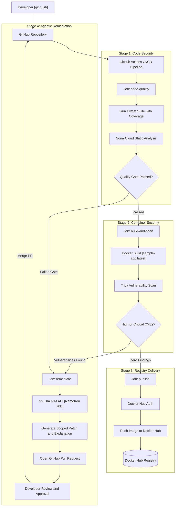
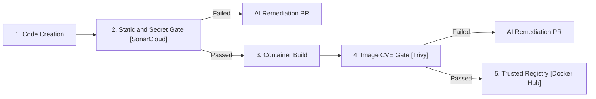
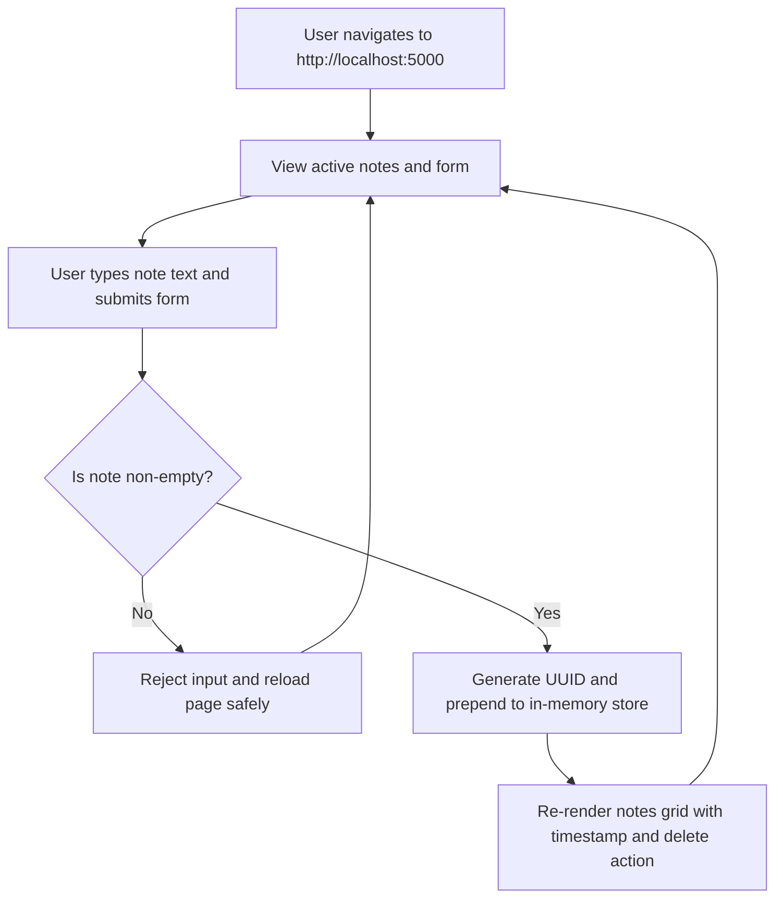
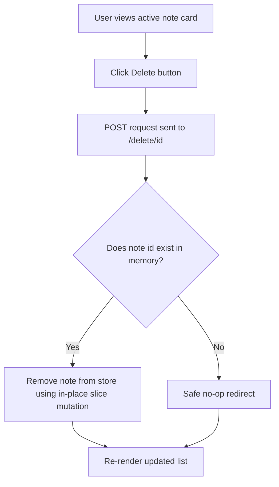
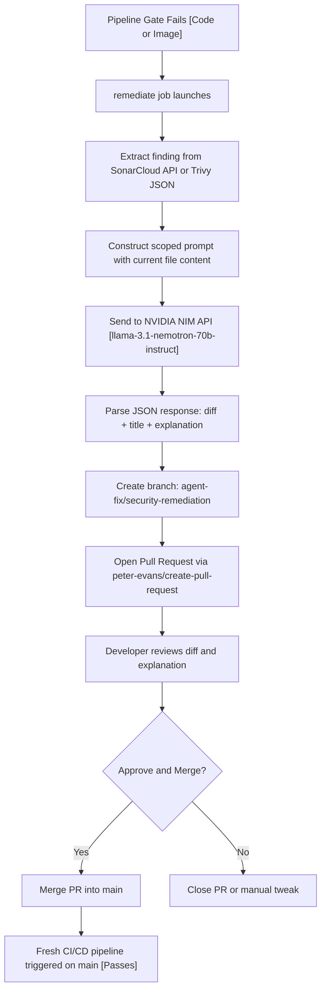
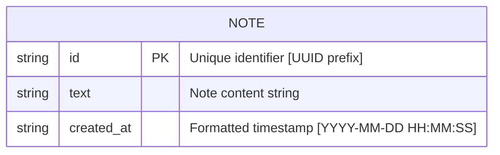
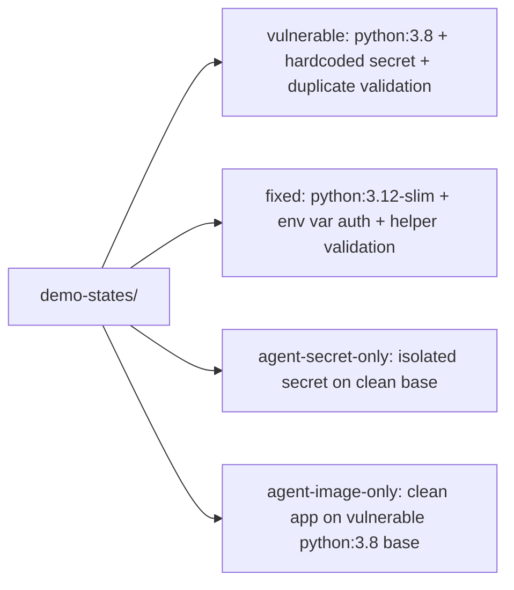

# SecureNotes — DevSecOps Secure CI/CD Pipeline & AI Remediation

**SecureNotes** is a complete, containerized notes application designed to demonstrate **Shift-Left Security** and **Human-in-the-Loop AI Remediation** built with **Flask**, **Docker**, **SonarCloud**, **Trivy**, **GitHub Actions**, and **NVIDIA NIM (Nemotron)**.

The project demonstrates automated security gates protecting an application lifecycle before any container artifacts reach a public registry, coupled with an AI remediation agent that autonomously extracts scan findings and generates reviewable Pull Requests.

---

## Table of Contents
1. [Application Overview & Features](#application-overview--features)
2. [Architecture & System Flow](#architecture--system-flow)
3. [DevSecOps Security Gates & Shift-Left Model](#devsecops-security-gates--shift-left-model)
4. [API Endpoints & Request Flow](#api-endpoints--request-flow)
5. [User & Remediation Flowcharts](#user--remediation-flowcharts)
6. [Data Model](#data-model)
7. [Required API Keys & Environment Variables](#required-api-keys--environment-variables)
8. [Local Quickstart & Execution](#local-quickstart--execution)
9. [Automated Testing Guide (Pytest)](#automated-testing-guide-pytest)
10. [Docker Container Verification](#docker-container-verification)
11. [AI Remediation Agent (NVIDIA Nemotron)](#ai-remediation-agent-nvidia-nemotron)
12. [Repeatable Demo Profiles & Reset Tooling](#repeatable-demo-profiles--reset-tooling)
13. [Step-by-Step Pipeline Verification Guide](#step-by-step-pipeline-verification-guide)

---

## Application Overview & Features

SecureNotes provides a secure, server-rendered interface for managing notes in an ephemeral in-memory container store:

- **Note Management**: Create, list, and delete notes in real time.
- **Input Sanitization**: Server-side validation rejecting empty, whitespace-only, or invalid payloads.
- **In-Memory Store**: Ephemeral list store with thread-safe in-place slice mutation.
- **Health Check Endpoint**: JSON endpoint (`GET /health`) for container readiness checks.
- **Modern User Interface**: Responsive light-themed UI built with Google Fonts Inter and crisp inline SVG icons without external framework dependencies.
- **1-Click Launcher**: Native Windows batch launcher (`run.bat`) with automatic Python environment resolution.

---

## Architecture & System Flow

The CI/CD pipeline enforces a strict multi-layer security barrier: source code must pass static code and secret scanning (SonarCloud) before compute is spent building a container image, and the resulting container image must pass vulnerability scanning (Trivy) before being published to Docker Hub. If any gate fails, the pipeline halts and branches to the NVIDIA Nemotron remediation agent.



---

## DevSecOps Security Gates & Shift-Left Model

The pipeline implements "Shift-Left" security by catching flaws as early as possible in the development lifecycle:



### Security Layers Enforced:
1. **Code Layer (SonarCloud)**:
   - **Hardcoded Secret Detection**: Flags plaintext API credentials, access tokens, and private keys (`python:S2068`).
   - **Code Smell & Maintainability**: Analyzes complexity and duplication.
   - **Quality Gate Enforcement**: Blocks pipeline progression on unresolved security hotspots or quality gate failures.
2. **Container Layer (Trivy)**:
   - **Base Image Vulnerability Analysis**: Scans OS packages and libraries for published CVEs.
   - **Severity Threshold**: Configured with `exit-code: 1` on `HIGH` or `CRITICAL` findings (`ignore-unfixed: true`).
3. **AI Remediation Boundary (Human-in-the-Loop)**:
   - The NVIDIA Nemotron agent is **strictly non-autonomous** regarding repository merges.
   - Workflow permissions are restricted to opening a Pull Request with a proposed diff and plain-language explanation; a human developer must review and merge every fix.

---

## API Endpoints & Request Flow

| Method | Route | Description | Request Body / Params | Response |
|---|---|---|---|---|
| `GET` | `/` | Renders the main notes web UI | None | `200 OK` (HTML) |
| `POST` | `/add` | Adds a new note to the in-memory store | Form: `note=<string>` | `302 Found` (Redirect to `/`) |
| `POST` | `/delete/<id>` | Deletes a note by its identifier | Path: `id=<string>` | `302 Found` (Redirect to `/`) |
| `GET` | `/health` | Container health check status | None | `200 OK` (JSON) |

### Health Check Response Schema:
```json
{
  "service": "securenotes",
  "status": "ok",
  "timestamp": "2026-09-14T18:00:00.000000"
}
```

---

## User & Remediation Flowcharts

### 1. Add Note Flow


### 2. Delete Note Flow


### 3. Agentic Remediation & Human Review Flow


---

## Data Model

The application uses an ephemeral in-memory store for the lifecycle of the running container:



---

## Required API Keys & Environment Variables

All API keys and configuration parameters are centralized in `.env.example`.

### Configuration Table:

| Variable / Secret | Where to Obtain | Purpose |
|---|---|---|
| `SONAR_TOKEN` | [SonarCloud Security Tokens](https://sonarcloud.io/account/security/) | Static code scan authentication and quality gate check |
| `SONAR_PROJECT_KEY` | SonarCloud Project Overview | Unique project key (`Siddhantshukla1657_SecureNotes_Devops_Miniproject`) |
| `SONAR_ORG` | SonarCloud Organization Page | Organization key (`siddhantshukla1657`) |
| `DOCKERHUB_USERNAME` | [Docker Hub](https://hub.docker.com) | Account username for container registry |
| `DOCKERHUB_TOKEN` | [Docker Hub Access Tokens](https://hub.docker.com/settings/security) | Read/Write Personal Access Token |
| `NVIDIA_API_KEY` | [NVIDIA NIM (build.nvidia.com)](https://build.nvidia.com) | Free API key for `nvidia/llama-3.1-nemotron-70b-instruct` |
| `NVIDIA_MODEL` | Set by default in `.env.example` | Target model: `nvidia/llama-3.1-nemotron-70b-instruct` |
| `APP_SECRET_KEY` | Local / Runtime | Runtime secret key for authentication |

### Setting Up GitHub Repository Secrets:
1. In your GitHub repository, open **Settings > Secrets and variables > Actions**.
2. Click **New repository secret** and add `SONAR_TOKEN`, `SONAR_PROJECT_KEY`, `SONAR_ORG`, `DOCKERHUB_USERNAME`, `DOCKERHUB_TOKEN`, and `NVIDIA_API_KEY`.
3. Under **Settings > Actions > General > Workflow permissions**:
   - Choose **Read and write permissions**.
   - Check **Allow GitHub Actions to create and approve pull requests**.

---

## Local Quickstart & Execution

### Option 1: 1-Click Batch File (Windows)
Double-click `run.bat` or execute in Command Prompt:
```cmd
run.bat
```
*This automatically verifies Python, activates your virtual environment if present, installs requirements, opens `http://localhost:5000` in your default browser, and launches the server.*

---

### Option 2: Manual Terminal Setup

```bash
# 1. Clone repository
git clone https://github.com/Siddhantshukla1657/SecureNotes_Devops_Miniproject.git
cd SecureNotes_Devops_Miniproject

# 2. Create virtual environment
python -m venv venv

# 3. Activate virtual environment
# On Windows (PowerShell):
.\venv\Scripts\Activate.ps1
# On Linux / macOS:
source venv/bin/activate

# 4. Install dependencies
pip install -r requirements.txt

# 5. Copy environment template
cp .env.example .env

# 6. Run the application
python app.py
```
Open **[http://localhost:5000](http://localhost:5000)** in your browser.

---

## Automated Testing Guide (Pytest)

The project includes an automated test suite verifying all routes, input validations, and error conditions.

### Run Automated Tests with Coverage:
```bash
python -m coverage run -m pytest tests/
python -m coverage xml -o coverage.xml
```

### Test Coverage Summary:
- `test_health_check`: Verifies `GET /health` returns `200 OK` and `{"status": "ok", "service": "securenotes"}`.
- `test_index_page`: Verifies `GET /` correctly renders HTML with the navigation header and note list.
- `test_add_note_success`: Verifies `POST /add` creates new notes in memory and redirects to index.
- `test_add_note_empty_rejected`: Verifies whitespace/empty submissions are rejected without data corruption.
- `test_delete_note_success`: Verifies `POST /delete/<id>` deletes the note by ID.
- `test_delete_note_nonexistent`: Verifies non-existent IDs do not cause exceptions.

---

## Docker Container Verification

### Build & Run Container Locally:
```bash
# Build Docker image
docker build -t securenotes:local .

# Run the container
docker run -d -p 5000:5000 --name securenotes-container securenotes:local

# Test container health endpoint
curl http://localhost:5000/health

# Stop and remove container
docker stop securenotes-container && docker rm securenotes-container
```

---

## AI Remediation Agent (NVIDIA Nemotron)

The remediation agent located at `scripts/remediate_agent.py` can be tested locally in offline mock mode or with live NVIDIA NIM credentials.

### Test Code Remediation (Hardcoded Secret & Code Smell):
```bash
python scripts/remediate_agent.py --finding-type code --mock
```
*Effect: Replaces hardcoded `API_KEY` in `app.py` with environment variable loading, extracts unified `validate_note_input()` helper, and writes `pr_title.txt` & `pr_body.md`.*

### Test Image Remediation (Base Image CVEs):
```bash
python scripts/remediate_agent.py --finding-type image --mock
```
*Effect: Upgrades `Dockerfile` base image to `python:3.12-slim` and writes PR metadata.*

---

## Repeatable Demo Profiles & Reset Tooling

Four pre-configured demo profiles exist under `demo-states/` to enable rapid, repeatable demonstrations:



### Switching Demo Profiles:

**On Windows (PowerShell):**
```powershell
# Restore vulnerable baseline locally:
.\scripts\reset-demo.ps1 -State vulnerable

# Restore completely fixed state:
.\scripts\reset-demo.ps1 -State fixed
```

**On Linux / macOS / Git Bash:**
```bash
# Restore state locally:
./scripts/reset-demo.sh vulnerable
```

---

## Step-by-Step Pipeline Verification Guide

### 1. Trigger Initial Security Scan
Pushing code with seeded issues triggers the `code-quality` and `build-and-scan` jobs. The gates detect seeded findings (hardcoded secrets in `app.py` or vulnerable base images in `Dockerfile`).

### 2. Automated Agent Diagnosis
When either gate fails, the `remediate` job launches:
- Extracts structured findings from SonarCloud API or Trivy JSON.
- Queries NVIDIA NIM (`nvidia/llama-3.1-nemotron-70b-instruct`).
- Generates a scoped patch and opens a Pull Request (`agent-fix/security-remediation`).

### 3. Human Review & Approval
A developer inspects the diff and proposed explanation on GitHub's Pull Request review screen. Merging the PR triggers a fresh run on `main`.

### 4. Clean Pipeline & Publishing
The merged code satisfies SonarCloud Quality Gate rules and Trivy CVE scanning with 0 high/critical vulnerabilities, progressing to the `publish` stage to push the verified container image to Docker Hub.
