# SecureNotes — Detailed Project Report
### DevSecOps Secure CI/CD Pipeline with AI-Powered Remediation

> **Authors:** Siddhant Shukla & Siddhant Raut  
> **Project:** SecureNotes DevOps Miniproject  
> **Date:** October 2026  
> **Repository:** [SecureNotes_Devops_Miniproject](https://github.com/Siddhantshukla1657/SecureNotes_Devops_Miniproject)

---

## Table of Contents

1. [Executive Summary](#1-executive-summary)
2. [Project Overview & Objectives](#2-project-overview--objectives)
3. [Technology Stack](#3-technology-stack)
4. [System Architecture](#4-system-architecture)
5. [Application Design](#5-application-design)
6. [DevSecOps CI/CD Pipeline](#6-devsecops-cicd-pipeline)
7. [Security Gates & Shift-Left Model](#7-security-gates--shift-left-model)
8. [AI Remediation Agent (NVIDIA Nemotron)](#8-ai-remediation-agent-nvidia-nemotron)
9. [Testing Strategy](#9-testing-strategy)
10. [Containerization & Docker](#10-containerization--docker)
11. [Demo Profiles & Reset Tooling](#11-demo-profiles--reset-tooling)
12. [Environment Configuration](#12-environment-configuration)
13. [Data Flow & Request Lifecycle](#13-data-flow--request-lifecycle)
14. [Security Analysis & Findings](#14-security-analysis--findings)
15. [Conclusion & Key Learnings](#15-conclusion--key-learnings)

---

## 1. Executive Summary

**SecureNotes** is a fully containerized Flask web application built as a practical demonstration of **DevSecOps** principles — specifically the **Shift-Left Security** methodology and **Human-in-the-Loop AI Remediation**. The project integrates automated security scanning, container hardening, and an NVIDIA NIM-powered AI agent that autonomously diagnoses and patches security vulnerabilities, all governed by a strict multi-stage GitHub Actions CI/CD pipeline.

> [!IMPORTANT]
> The pipeline enforces a **zero-trust gate model** — no container artifact reaches the public registry unless it passes both static code analysis (SonarCloud) AND container vulnerability scanning (Trivy).

### Key Achievements at a Glance

| Dimension | Outcome |
|---|---|
| Static Code Gate | SonarCloud Quality Gate enforced on every push |
| Container CVE Gate | Trivy blocks on HIGH or CRITICAL CVEs |
| AI Remediation | NVIDIA Nemotron generates targeted security patches |
| Human Oversight | All AI fixes require developer PR review before merge |
| Test Coverage | 6 automated pytest cases covering all API routes |
| Demo Profiles | 4 pre-configured states for repeatable demonstrations |

---

## 2. Project Overview & Objectives

### 2.1 Problem Statement

Modern software delivery pipelines often treat security as an afterthought — vulnerabilities are discovered in production, remediation is manual and slow, and developers lack real-time feedback on security issues they introduce. This project addresses these gaps by:

1. **Shifting security left** — detecting issues at code-commit time, not deployment time.
2. **Automating remediation** — an AI agent proposes fixes, eliminating manual triage delays.
3. **Enforcing human oversight** — the AI agent cannot merge its own changes; a human developer reviews every proposed fix.

### 2.2 Core Application Features

- **Note Management**: Create, view, and delete notes via a server-rendered web UI.
- **Input Sanitization**: Server-side validation rejects empty, whitespace-only, or malformed payloads.
- **Ephemeral In-Memory Store**: Thread-safe in-place slice mutation for the container lifetime.
- **Health Endpoint**: JSON-formatted `/health` endpoint for container readiness probes.
- **Responsive UI**: Built with Google Fonts (Inter), crisp inline SVG icons, no external CSS frameworks.
- **1-Click Windows Launcher**: `run.bat` auto-resolves Python, activates venv, installs deps, opens browser.

### 2.3 DevOps Objectives

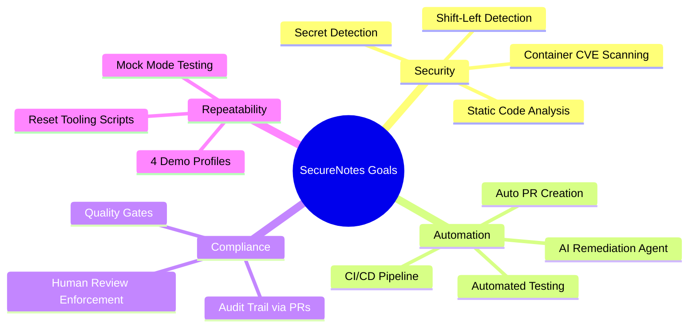

---

## 3. Technology Stack

### 3.1 Component Overview

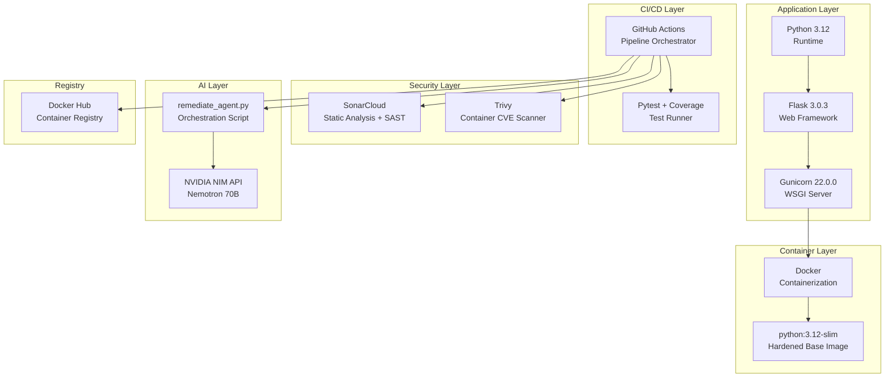

### 3.2 Dependency Matrix

| Package | Version | Purpose |
|---|---|---|
| `Flask` | 3.0.3 | Web framework, routing, template rendering |
| `Gunicorn` | 22.0.0 | Production-grade WSGI HTTP server |
| `pytest` | 8.2.2 | Automated test runner |
| `requests` | 2.32.3 | HTTP client (used by remediation agent) |
| `python-dotenv` | 1.0.1 | `.env` file environment loading |
| `coverage` | 7.5.4 | Code coverage measurement |
| `pytest-cov` | 5.0.0 | Coverage plugin for pytest |

---

## 4. System Architecture

### 4.1 High-Level CI/CD Pipeline Architecture

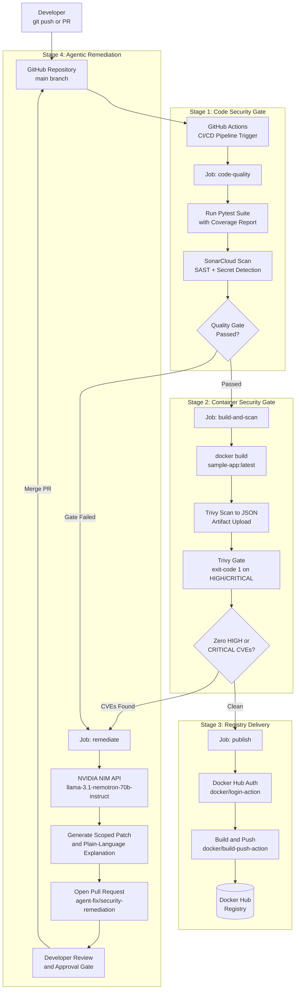

### 4.2 Repository & File Structure

```
SecureNotes_Devops_Miniproject/
├── app.py                          # Flask application core
├── Dockerfile                      # Hardened container image definition
├── requirements.txt                # Python dependencies
├── sonar-project.properties        # SonarCloud scan configuration
├── pytest.ini                      # Pytest configuration
├── .env / .env.example             # Environment variable templates
├── run.bat                         # Windows 1-click launcher
├── reset-demo.bat                  # Demo state reset (Windows)
│
├── .github/
│   └── workflows/
│       └── pipeline.yml            # 4-Stage GitHub Actions pipeline
│
├── scripts/
│   ├── remediate_agent.py          # NVIDIA NIM remediation agent
│   ├── reset-demo.ps1              # PowerShell reset script
│   └── reset-demo.sh               # Bash reset script (Linux/macOS)
│
├── tests/
│   └── test_app.py                 # 6 pytest unit test cases
│
├── templates/
│   └── index.html                  # Server-rendered Jinja2 template
│
├── static/                         # CSS and static assets
│
├── demo-states/
│   ├── vulnerable/                 # Seeded: python:3.8 + hardcoded secret
│   ├── fixed/                      # Clean: python:3.12-slim + env var auth
│   ├── agent-secret-only/          # Isolated: secret only, clean base
│   └── agent-image-only/           # Isolated: vulnerable base, clean app
│
└── docs/
    └── PROJECT_REPORT.md           # This document
```

---

## 5. Application Design

### 5.1 API Endpoint Map

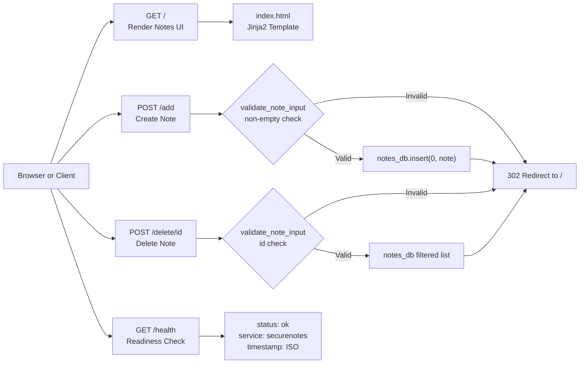

### 5.2 In-Memory Data Model

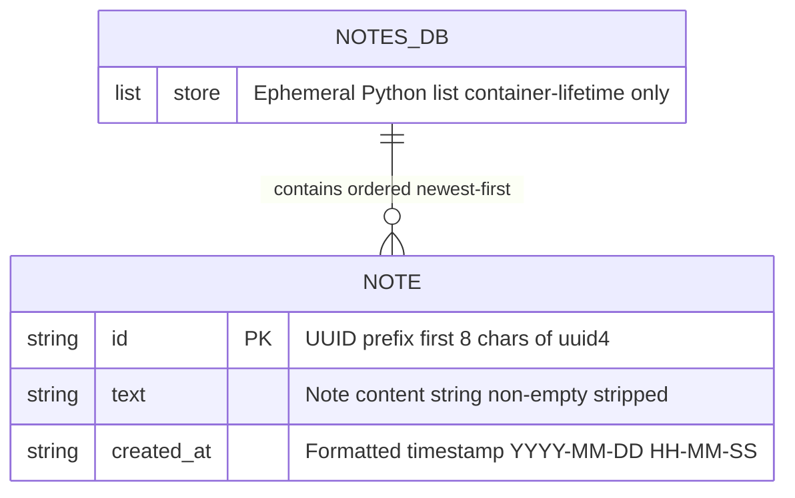

> [!NOTE]
> The in-memory store (`notes_db`) is an ephemeral Python list. All notes are lost when the container restarts. This is an intentional design choice for a demo application — a production system would use a persistent database.

### 5.3 Note Lifecycle Flowchart

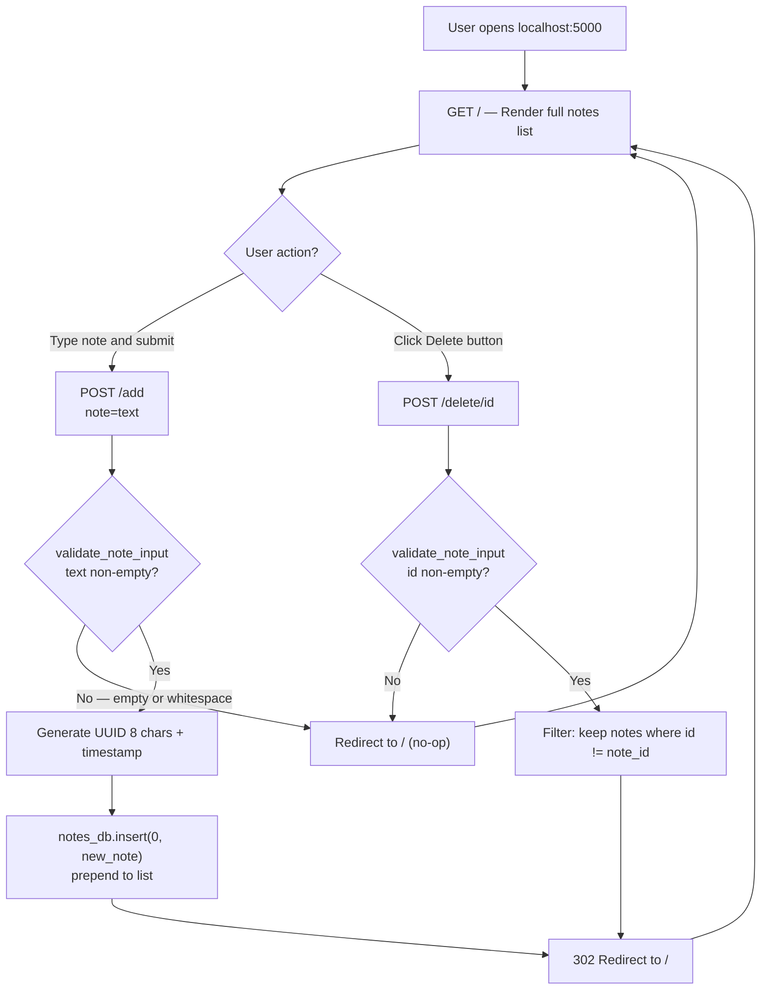

---

## 6. DevSecOps CI/CD Pipeline

### 6.1 Pipeline Trigger Conditions

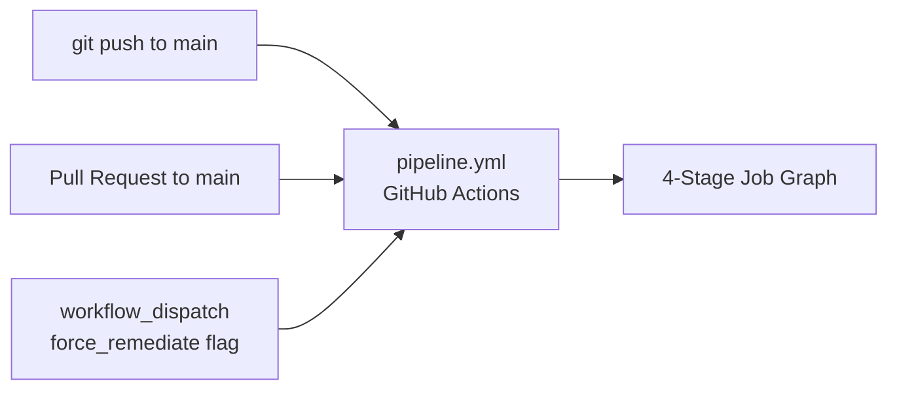

### 6.2 Detailed Job Dependency Graph

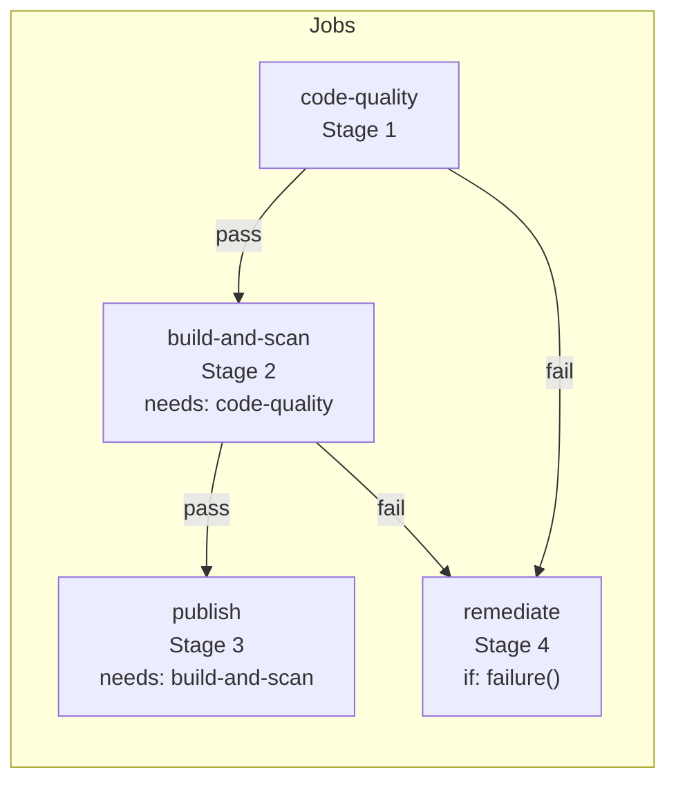

### 6.3 Stage 1 — Code Quality & Secret Scan (SonarCloud)

**Job:** `code-quality` | **Runner:** `ubuntu-latest`

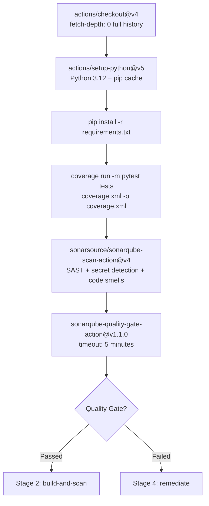

**SonarCloud Rules Enforced:**
- `python:S2068` — Hardcoded credential / secret detection
- Code smell analysis (duplication, complexity)
- Quality Gate blocks pipeline on unresolved hotspots

### 6.4 Stage 2 — Container Build & CVE Scan (Trivy)

**Job:** `build-and-scan` | **Runner:** `ubuntu-latest` | **Needs:** `code-quality`

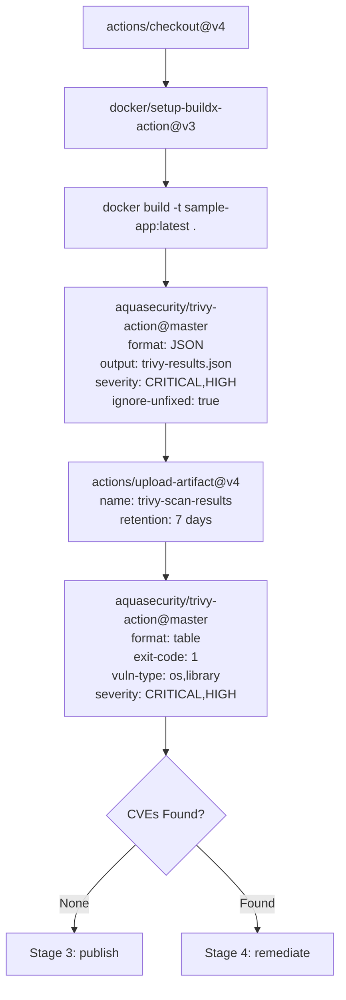

> [!TIP]
> Trivy runs **twice**: once to produce a JSON artifact for the AI remediation agent, and once again with `exit-code: 1` to enforce the pipeline gate. The JSON artifact is uploaded even on failure so the remediation agent can parse it.

### 6.5 Stage 3 — Registry Delivery (Docker Hub)

**Job:** `publish` | **Runner:** `ubuntu-latest` | **Needs:** `build-and-scan`

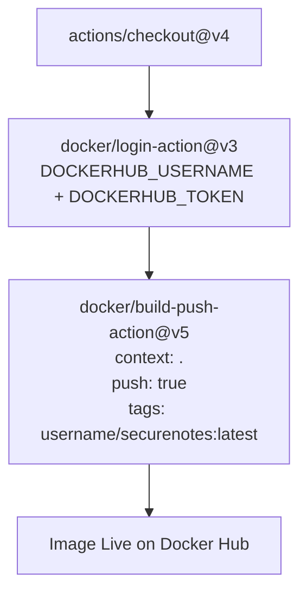

---

## 7. Security Gates & Shift-Left Model

### 7.1 Shift-Left Security Principle

"Shift Left" means moving security checks as early as possible in the development lifecycle — before code reaches production, or even before it is built into a container.

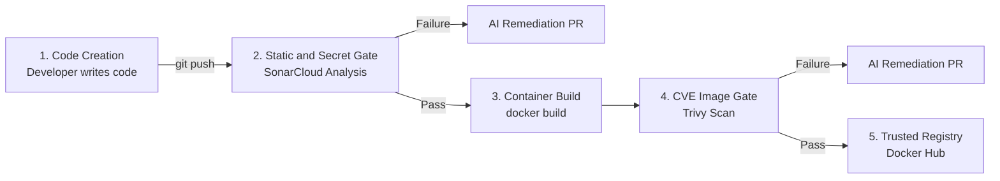

### 7.2 Security Layer Summary

| Layer | Tool | What It Detects | Action on Failure |
|---|---|---|---|
| **Code / SAST** | SonarCloud | Hardcoded secrets (`python:S2068`), code smells, duplication | Blocks pipeline, triggers AI remediation |
| **Container OS** | Trivy | CVEs in base OS packages (Debian), library vulnerabilities | Blocks pipeline, triggers AI remediation |
| **AI Boundary** | Human Review | PR review before any merge | Developer must approve; agent cannot self-merge |

### 7.3 Vulnerability Seeding vs. Hardened States

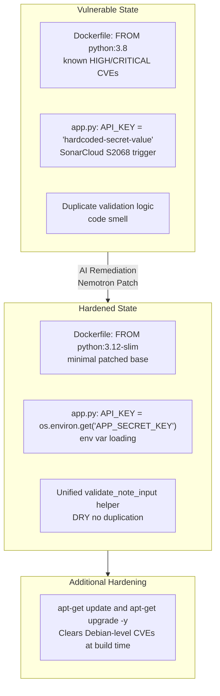

---

## 8. AI Remediation Agent (NVIDIA Nemotron)

### 8.1 Agent Architecture

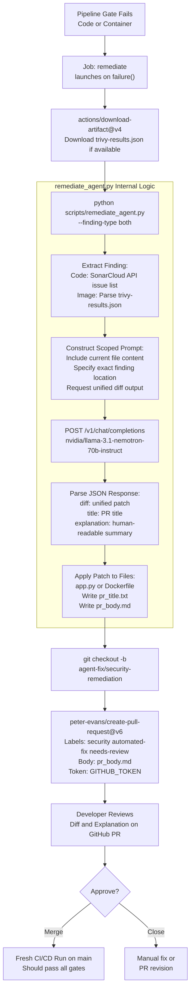

### 8.2 Agent Operation Modes

| Mode | Command | Description |
|---|---|---|
| **Mock - Code** | `python scripts/remediate_agent.py --finding-type code --mock` | Simulates SonarCloud finding; patches hardcoded secret + extracts helper |
| **Mock - Image** | `python scripts/remediate_agent.py --finding-type image --mock` | Simulates Trivy finding; upgrades base image to `python:3.12-slim` |
| **Live - Both** | `python scripts/remediate_agent.py --finding-type both` | Live mode: queries SonarCloud API + parses Trivy JSON + calls NVIDIA NIM |

### 8.3 Human-in-the-Loop Boundary

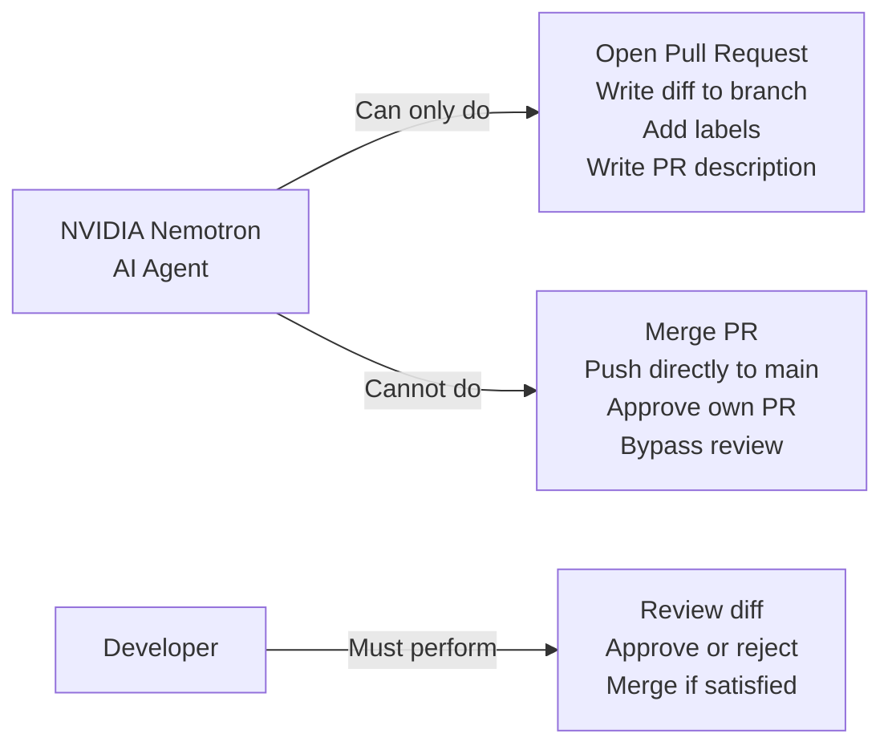

> [!CAUTION]
> Workflow permissions are **explicitly scoped**: `contents: write` and `pull-requests: write` only. Direct push to `main` is blocked; the agent's only mechanism to affect production is through the PR review gate.

---

## 9. Testing Strategy

### 9.1 Test Suite Overview

The project includes **6 automated pytest test cases** in `tests/test_app.py` covering all API routes and edge cases.

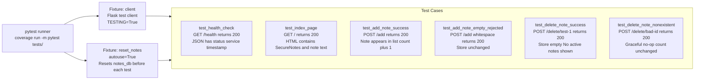

### 9.2 Test Coverage Matrix

| Test Case | Route | Method | Expected Status | Assertion |
|---|---|---|---|---|
| `test_health_check` | `/health` | GET | 200 | JSON keys: `status`, `service`, `timestamp` |
| `test_index_page` | `/` | GET | 200 | HTML contains `SecureNotes` and existing note text |
| `test_add_note_success` | `/add` | POST | 200 (after redirect) | Note visible in DOM; `notes_db` count = 2 |
| `test_add_note_empty_rejected` | `/add` | POST | 200 (after redirect) | `notes_db` count unchanged |
| `test_delete_note_success` | `/delete/test-1` | POST | 200 (after redirect) | `notes_db` count = 0; "No active notes" visible |
| `test_delete_note_nonexistent` | `/delete/bad-id` | POST | 200 (after redirect) | `notes_db` count unchanged |

### 9.3 Coverage Configuration

Coverage is collected via:
```bash
python -m coverage run -m pytest tests/
python -m coverage xml -o coverage.xml   # consumed by SonarCloud
```

The `coverage.xml` artifact is consumed by SonarCloud for combined code quality and coverage reporting.

---

## 10. Containerization & Docker

### 10.1 Dockerfile Layers

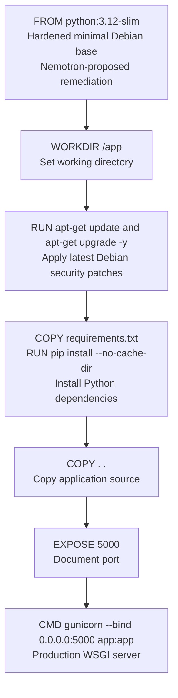

### 10.2 Base Image Evolution

| State | Base Image | Risk | Trivy Gate |
|---|---|---|---|
| **Vulnerable** | `python:3.8` | HIGH/CRITICAL Debian CVEs | Blocks |
| **Hardened** | `python:3.12-slim` + `apt-get upgrade` | Minimal exposure | Passes |

### 10.3 Local Container Commands

```bash
# Build
docker build -t securenotes:local .

# Run
docker run -d -p 5000:5000 --name securenotes-container securenotes:local

# Verify health
curl http://localhost:5000/health

# Stop and clean up
docker stop securenotes-container && docker rm securenotes-container
```

---

## 11. Demo Profiles & Reset Tooling

### 11.1 Demo State Machine

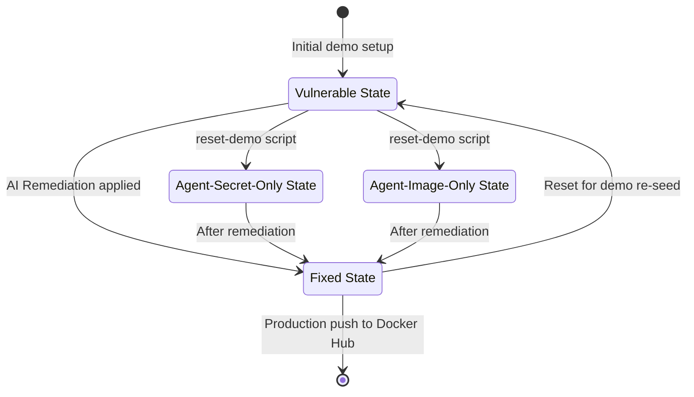

### 11.2 Demo Profile Comparison

| Profile | Folder | Dockerfile Base | `app.py` Secret | Validation Logic |
|---|---|---|---|---|
| `vulnerable` | `demo-states/vulnerable/` | `python:3.8` | Hardcoded literal | Duplicated inline |
| `fixed` | `demo-states/fixed/` | `python:3.12-slim` | `os.environ.get(...)` | `validate_note_input()` |
| `agent-secret-only` | `demo-states/agent-secret-only/` | `python:3.12-slim` | Hardcoded literal | Duplicated inline |
| `agent-image-only` | `demo-states/agent-image-only/` | `python:3.8` | `os.environ.get(...)` | `validate_note_input()` |

### 11.3 Reset Commands

```powershell
# Windows PowerShell
.\scripts\reset-demo.ps1 -State vulnerable
.\scripts\reset-demo.ps1 -State fixed
.\scripts\reset-demo.ps1 -State agent-secret-only
.\scripts\reset-demo.ps1 -State agent-image-only
```

```bash
# Linux / macOS / Git Bash
./scripts/reset-demo.sh vulnerable
./scripts/reset-demo.sh fixed
```

---

## 12. Environment Configuration

### 12.1 Required Secrets & API Keys

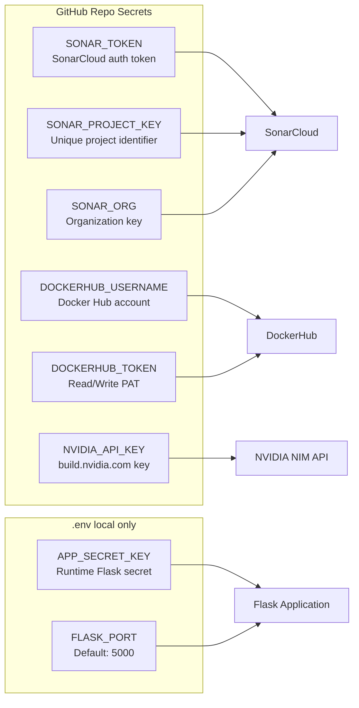

### 12.2 Full Configuration Reference

| Variable | Required | Default | Purpose |
|---|---|---|---|
| `SONAR_TOKEN` | Yes | — | SonarCloud authentication |
| `SONAR_PROJECT_KEY` | Yes | `Siddhantshukla1657_SecureNotes_Devops_Miniproject` | SonarCloud project identifier |
| `SONAR_ORG` | Yes | `siddhantshukla1657` | SonarCloud organization key |
| `DOCKERHUB_USERNAME` | Yes | — | Docker Hub account username |
| `DOCKERHUB_TOKEN` | Yes | — | Docker Hub R/W Access Token |
| `NVIDIA_API_KEY` | Yes | — | NVIDIA NIM API authentication |
| `NVIDIA_MODEL` | Optional | `nvidia/llama-3.1-nemotron-70b-instruct` | Target LLM model |
| `APP_SECRET_KEY` | Optional | `default-dev-key` | Flask session/auth key |
| `FLASK_PORT` | Optional | `5000` | HTTP listener port |

---

## 13. Data Flow & Request Lifecycle

### 13.1 End-to-End Developer Workflow

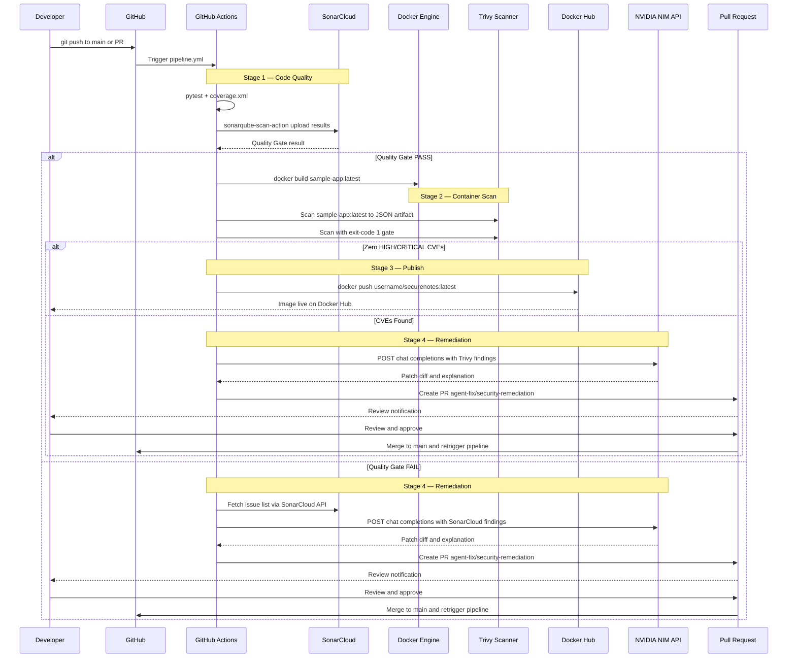

---

## 14. Security Analysis & Findings

### 14.1 Threat Model Overview

```mermaid
graph TD
    subgraph Threats["Identified Threat Vectors"]
        T1["Secret Exposure\nHardcoded API keys in source code\nleaked via git history"]
        T2["Supply Chain CVEs\nOutdated base OS packages\nwith published exploits"]
        T3["Input Injection\nUnvalidated note text\nXSS or overflow"]
        T4["Autonomous AI Risk\nAI agent self-merging\nwithout human review"]
    end

    subgraph Mitigations["Mitigations Implemented"]
        M1["SonarCloud S2068\nBlocks secrets at commit time"]
        M2["Trivy + python:3.12-slim + apt upgrade\nEliminate known CVEs"]
        M3["validate_note_input\nServer-side strip and non-empty check"]
        M4["Human-in-the-Loop PR Gate\nAgent can only open PRs not merge them"]
    end

    T1 --> M1
    T2 --> M2
    T3 --> M3
    T4 --> M4
```

### 14.2 Vulnerability Seeding Details

| Finding Type | Rule / CVE | Seeded Location | AI Fix Proposed |
|---|---|---|---|
| Hardcoded Secret | `python:S2068` | `app.py` — `API_KEY = "literal"` | Replace with `os.environ.get("APP_SECRET_KEY")` |
| Code Smell | Duplication | `add_note()` + `delete_note()` — inline validation | Extract `validate_note_input()` helper |
| Container CVE | Multiple HIGH | `FROM python:3.8` OS packages | Upgrade to `FROM python:3.12-slim` + `apt upgrade` |

---

## 15. Conclusion & Key Learnings

### 15.1 Project Summary

SecureNotes demonstrates a complete, production-inspired DevSecOps pipeline where security is not bolted-on after the fact, but is **integrated as a first-class concern at every stage of the software lifecycle**.

```mermaid
flowchart LR
    A["Shift-Left\nSecurity"] --> B["Automated\nGates"] --> C["AI-Assisted\nRemediation"] --> D["Human\nOversight"] --> E["Trusted\nDelivery"]
```

### 15.2 Key Technical Achievements

| Achievement | Implementation |
|---|---|
| **Zero-Trust Gate Pipeline** | Both SonarCloud AND Trivy must pass before publish |
| **AI-Powered Triage** | NVIDIA Nemotron 70B generates real, compilable patches |
| **Non-Autonomous AI** | Strict PR-only boundary; agent cannot push to main |
| **Repeatable Demos** | 4 seeded states + PowerShell/Bash reset scripts |
| **Full Test Harness** | 6 pytest cases, coverage.xml fed to SonarCloud |
| **Hardened Container** | `python:3.12-slim` + `apt upgrade` clears OS CVEs |

### 15.3 DevSecOps Maturity Indicators

| Maturity Dimension | Evidence |
|---|---|
| **Automation** | Full CI/CD with no manual build or scan steps |
| **Speed** | Secrets caught at Stage 1 before compute-heavy build |
| **AI Augmentation** | LLM reduces mean time to remediation for known patterns |
| **Compliance** | Audit trail via GitHub PR history and pipeline run logs |
| **Extensibility** | Mock mode enables offline testing of remediation agent |

---

> [!NOTE]
> This report was generated for the **SecureNotes DevOps Miniproject** — a demonstration of modern DevSecOps practices. All diagrams are rendered in Mermaid.js and are compatible with GitHub's native Markdown renderer.

---

*Report generated: October 2026 | Authors: Siddhant Shukla & Siddhant Raut | Repository: [github.com/Siddhantshukla1657/SecureNotes_Devops_Miniproject](https://github.com/Siddhantshukla1657/SecureNotes_Devops_Miniproject)*
