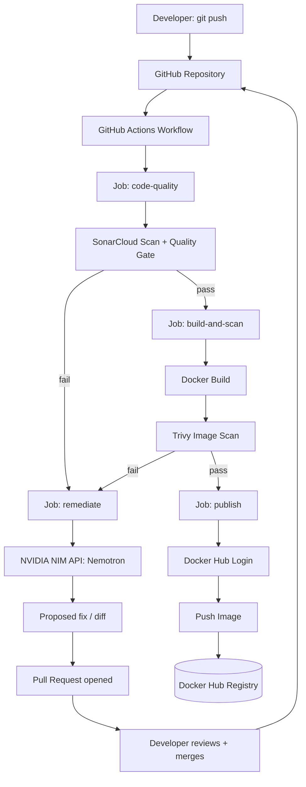
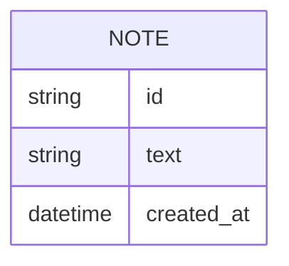

# SecureNotes Secure CI Pipeline — Architecture

> **Status:** Draft | **Last updated:** September 14, 2026 | **Authors:** Siddhant Shukla & Siddhant Raut

## 1. System Overview
SecureNotes is a single-container Flask application that serves a server-rendered notes UI. It exists as the subject of a larger CI/CD system: a GitHub Actions pipeline that scans the app's source code with SonarCloud, builds it into a Docker image, scans that image with Trivy, and — only if both gates pass — publishes the image to Docker Hub. When either gate fails, a remediation agent (built on Nemotron via the NVIDIA NIM API) reads the failure's findings, proposes a fix, and opens a pull request for a human to review. The agent never commits or merges on its own. The app itself is intentionally simple; the pipeline and its remediation agent are the actual system being evaluated.

## 2. Architecture Diagram

## 3. Tech Stack
| Layer | Technology | Rationale |
|---|---|---|
| Frontend | Server-rendered HTML via Jinja2 + Pico.css (CDN) | No build step needed; gives a real, styled UI for the demo without adding a separate frontend build stage to the pipeline |
| Backend | Python 3 + Flask | Lightweight, fast to build/scan, and SonarQube's Python rules reliably catch the seeded secret and code smell |
| Data store | In-memory Python list (no database) | Persistence is out of scope; keeps the app and pipeline fast and dependency-free |
| Containerization | Docker | Required by the assignment; base image intentionally starts as `python:3.8`, remediated to `python:3.12-slim` |
| CI/CD | GitHub Actions | Free for public repos; native `needs:` job dependencies map cleanly onto the gated pipeline stages |
| Code scanning | SonarCloud (hosted) | Free tier, and — unlike a self-hosted SonarQube instance — reachable from GitHub-hosted runners without extra tunneling infrastructure |
| Image scanning | Trivy (`aquasecurity/trivy-action`) | Free, open-source, and integrates as a single GitHub Action step |
| Remediation agent | NVIDIA NIM API (Nemotron model, e.g. `nvidia/llama-3.1-nemotron-70b-instruct`) | OpenAI-compatible endpoint, free developer-tier credits, capable of generating a scoped code diff from a structured finding |
| PR automation | `peter-evans/create-pull-request` GitHub Action | Standard, well-supported way to open a PR from within a workflow without giving the agent direct push access to `main` |
| Registry | Docker Hub (free tier) | Standard, zero-cost destination for the final published image |
| Demo tooling | Bash script (`reset-demo.sh`) + pre-written file snapshots (`demo-states/`) | Lets any of the four demo states be restored with one command and a push, so the pipeline can be re-demonstrated repeatedly without manual file edits |

## 4. Component Breakdown

### 4.1 SecureNotes App (Flask)
- **Responsibility:** Serve the notes UI, handle add/delete actions, expose a health check.
- **Interfaces:** HTTP routes `GET /`, `POST /add`, `POST /delete/<id>`, `GET /health`.
- **Depends on:** In-memory notes store (module-level list).

### 4.2 GitHub Actions Workflow
- **Responsibility:** Orchestrate the gated jobs (`code-quality`, `build-and-scan`, `remediate`, `publish`) in sequence, stopping the main chain on failure and branching to remediation when appropriate.
- **Interfaces:** Triggered by `push` to `main`; reads GitHub Actions secrets (`SONAR_TOKEN`, `DOCKERHUB_USERNAME`, `DOCKERHUB_TOKEN`, `NVIDIA_API_KEY`).
- **Depends on:** SonarCloud project, Docker Hub account, NVIDIA NIM API access.

### 4.3 SonarCloud
- **Responsibility:** Static analysis of the source code; computes and reports a Quality Gate pass/fail.
- **Interfaces:** Receives scan data via the `sonarsource/sonarqube-scan-action`; Quality Gate result read back via `sonarsource/sonarqube-quality-gate-action`.
- **Depends on:** A SonarCloud project pre-linked to the GitHub repo, and a valid `SONAR_TOKEN`.

### 4.4 Trivy
- **Responsibility:** Scan the built Docker image for known CVEs in OS packages and dependencies.
- **Interfaces:** Runs as a GitHub Action step against the locally built image tag; exits non-zero on HIGH/CRITICAL findings.
- **Depends on:** The Docker image having been built in the same job.

### 4.5 Remediation Agent
- **Responsibility:** Triggered when `code-quality` or `build-and-scan` fails. Reads the relevant finding (SonarCloud issue JSON or Trivy CVE JSON), sends it to Nemotron with a scoped prompt asking for a minimal fix, and passes the returned diff to the PR-creation step.
- **Interfaces:** Calls `https://integrate.api.nvidia.com/v1/chat/completions` (OpenAI-compatible) with the `NVIDIA_API_KEY` secret; outputs a diff/patch consumed by `peter-evans/create-pull-request`.
- **Depends on:** A failed `code-quality` or `build-and-scan` job, a valid `NVIDIA_API_KEY`, and the structured finding data from that job's output.
- **Explicit boundary:** never pushes to `main` directly and never merges its own PR — it only ever proposes.

### 4.6 Demo Reset Tooling
- **Responsibility:** Restore any of the four demo states (fully vulnerable, fully fixed, secret-only, image-only) on command, so the pipeline can be re-run for repeated demonstrations without manual file editing.
- **Interfaces:** A shell script (`scripts/reset-demo.sh <state>`) invoked manually before or during a demo; reads from pre-written file snapshots under `demo-states/`.
- **Depends on:** Git push access to `main` (same as any normal developer workflow) — this tooling has no elevated permissions of its own.

### 4.7 Docker Hub
- **Responsibility:** Host the final, validated image.
- **Interfaces:** Authenticated via `docker/login-action`; receives the image via `docker push`.
- **Depends on:** Valid `DOCKERHUB_USERNAME` / `DOCKERHUB_TOKEN` secrets.

## 5. Data Model

Notes exist only in memory for the lifetime of the running container — there is intentionally no persistent database, since data durability is outside this project's scope.

## 6. API Design
| Method | Endpoint | Purpose | Auth required |
|---|---|---|---|
| GET | `/` | Render the notes list + add-note form | No |
| POST | `/add` | Add a new note | No (originally gated by the seeded hardcoded `API_KEY`, removed in remediation) |
| POST | `/delete/<id>` | Delete a note by id | No (same as above) |
| GET | `/health` | Confirm the container is running | No |

## 7. Infrastructure & Deployment
- **Hosting for CI:** GitHub-hosted `ubuntu-latest` runners for all jobs — no self-hosted runner infrastructure.
- **Environments:** Single environment (no dev/staging/prod split) — appropriate for a mini-project scope.
- **Deployment target:** Docker Hub only; there is no live deployment target (e.g. a cloud host) beyond publishing the image, since the assignment's focus is the pipeline, not production hosting.
- **CI/CD flow:** `code-quality` → (on pass) `build-and-scan` → (on pass) `publish`. On failure of either gate, a `remediate` job runs instead, ending in an open pull request rather than continuing the main chain.

## 8. Security Considerations
- **Secrets management:** All pipeline credentials (`SONAR_TOKEN`, `DOCKERHUB_USERNAME`, `DOCKERHUB_TOKEN`, `NVIDIA_API_KEY`) are stored as GitHub Actions repository secrets, never committed to source.
- **Application secret handling:** The app's own hardcoded `API_KEY` is a deliberately seeded anti-pattern for Phase 1, removed during Phase 4 remediation in favor of an environment-variable-based approach.
- **Shift-left enforcement:** The code-scan gate runs before any image is even built, so code-level issues are caught before compute is spent on a build that would need to be scrapped anyway.
- **Image hardening:** The base image is swapped from `python:3.8` (EOL, known CVEs) to `python:3.12-slim` (minimal, actively maintained) as the primary image-layer fix.
- **Human-in-the-loop automation:** The remediation agent is deliberately restricted to opening pull requests. It has no permissions to push to `main` or approve/merge its own PR — a human must review and merge every proposed change. This boundary is a design decision, not an incidental limitation, and is worth stating explicitly in the report as the responsible way to introduce agentic automation into a CI/CD pipeline.
- **Threat model scope:** This project addresses source-code hygiene and base-image CVEs only. It does not address runtime security (e.g. container escape, network segmentation), which is out of scope for the assignment.

## 9. Scalability & Performance
Not a design concern for this project — SecureNotes serves a single in-memory data set with no expected concurrent load beyond a demo or grading session. The pipeline's "performance" concern is keeping each run fast enough (a few minutes) to be re-run comfortably during development and live demonstration, including the added latency of a Nemotron API call during the remediation path.

## 10. Key Technical Decisions & Tradeoffs
| Decision | Alternatives considered | Why this choice |
|---|---|---|
| SonarCloud instead of self-hosted SonarQube | Self-hosted SonarQube via `docker run`, exposed to GitHub Actions via ngrok tunnel | GitHub-hosted runners cannot reach a scanner on `localhost`; SonarCloud avoids that hosting gap entirely and is free for public repos |
| Server-rendered Flask + Jinja2 UI instead of a separate React frontend | Separate SPA frontend with its own build pipeline | Keeps the pipeline focused on code/image security scanning rather than frontend build tooling; still gives a real, screenshot-worthy UI |
| In-memory data store instead of a real database | SQLite or Postgres | Persistence isn't part of what's being evaluated; adding a database would only add setup risk without adding to the security story |
| `python:3.12-slim` as the remediated base image | Alpine-based image, distroless image | Slim variant keeps `pip install` behavior predictable while still meaningfully reducing the image's attack surface and CVE count versus `python:3.8` |
| NVIDIA NIM (Nemotron) for the remediation agent instead of a purely rule-based fix script | Rule-based pattern-matching fix script only | An LLM-based agent generalizes beyond the specific seeded issues and is a stronger demonstration of "agentic remediation," while still being free-tier accessible via NVIDIA's developer program |
| PR-only agent output, no auto-merge | Auto-committing the fix directly to `main` | Keeps a human in the loop for every change the agent proposes, avoiding the risk of an incorrect or incomplete automated fix reaching `main` unreviewed |

## 11. Open Technical Questions
- [ ] Confirm final Docker Hub repository name/visibility before the final publish run.
- [ ] Decide whether to also gate on Trivy findings in dependency files (e.g. `requirements.txt`) in addition to OS-package CVEs, or keep scope to the base image only.
- [ ] Decide whether the `remediate` job runs automatically on every failure or is manually triggered (`workflow_dispatch`) to conserve NVIDIA API credits during development.
