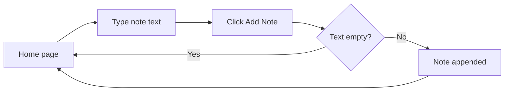
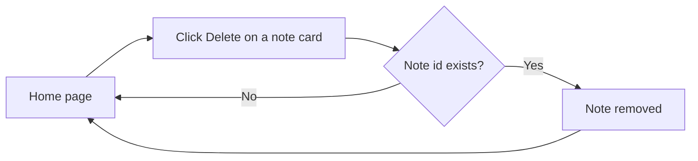
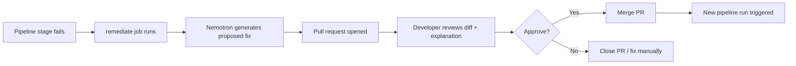

# SecureNotes Secure CI Pipeline — Design Document

> **Status:** Draft | **Last updated:** September 14, 2026

## 1. Design Principles
- **Demo-first clarity:** every screen and state should read clearly on a shared screen or in a screen recording during a viva — no reliance on the presenter narrating what's happening.
- **Zero build-step styling:** all visual polish comes from a single CDN stylesheet, keeping the pipeline's build stage focused on the app itself, not frontend tooling.
- **Visible product, not a raw API:** the whole point of having a UI at all is to make the "before/after" story land as a real product being protected, so every interaction should feel complete (add, see it appear, delete, see it disappear).
- **Minimal but not bare:** a small amount of intentional styling (a themed header, card layout) goes a long way toward looking "showcaseable" without adding real design scope.
- **Visible human-in-the-loop:** wherever the remediation agent is involved, the review step (the pull request itself) should be shown as clearly as the failure and the fix — the point being demonstrated is "agent proposes, human decides," not just "agent fixes."
- **Repeatable, not one-shot:** since this pipeline will be demonstrated more than once, the failing and passing states should be restorable on command (via the reset tooling) rather than requiring manual file edits before every run — this keeps every demo consistent and reduces the chance of a live mistake.

## 2. User Flows

### 2.1 Add a note

Narrative walkthrough: The user lands on the home page, sees any existing notes as cards, and types into the add-note field at the top. Clicking "Add Note" submits the form; if the field was empty, the page simply reloads with no change. Otherwise, the new note appears as a card at the top (or bottom) of the list immediately on reload.

### 2.2 Delete a note

Narrative walkthrough: Each note card has a small "Delete" button. Clicking it submits a form to `/delete/<id>`; the page reloads with that note no longer present in the list.

### 2.3 Agent-proposed remediation (review flow)

Narrative walkthrough: When a gate fails, the `remediate` job sends the finding to Nemotron and receives a proposed diff. A pull request is opened automatically, containing the diff and a short explanation of what it changes and why. The developer reviews this like any other PR — reading the diff, checking the explanation makes sense — and either merges it (triggering a fresh pipeline run) or closes it in favor of a manual fix. This flow doesn't need a custom UI; GitHub's own PR review screen is the "screen" being shown here, which is a deliberate choice — using a review surface everyone already trusts reinforces the human-in-the-loop framing better than a custom dashboard would.

## 3. Key Screens / Views

### 3.1 Home (Notes) Screen
- **Purpose:** The single screen of the app — shows the add-note form and the current list of notes.
- **Key elements:** A page header (app name + a small "Secure Pipeline Demo" badge), an add-note input with a submit button, and a vertical list of note cards, each with its text and a delete button.
- **States:**
  - Empty state — a centered message like "No notes yet — add one above" instead of a blank area.
  - Loading — not applicable in a meaningful way, since this is a server-rendered page with no client-side async calls; each action is a full page reload.
  - Error state — if a form submission fails validation (e.g. empty text), the page simply reloads unchanged; no separate error screen is needed for this scope.
  - Populated — one card per note, most recent note visually distinguishable (e.g. at the top of the list).

### 3.2 Agent Pull Request (GitHub's native PR screen)
- **Purpose:** Where the developer reviews and decides on the agent's proposed fix. This is not a custom-built screen — it's GitHub's existing pull request interface, used deliberately rather than building something bespoke.
- **Key elements:** The diff view (showing exactly what the agent changed), the PR description (the agent's plain-language explanation of the fix and which finding it addresses), and the standard merge/close actions.
- **States:** Open (awaiting review), approved and merged, or closed without merging — all standard GitHub PR states, requiring no additional design work.

## 4. Component Library / Style Guide
| Token | Value | Usage |
|---|---|---|
| Primary color | `#0f766e` (teal) | Header accents, primary button, "Secure Pipeline Demo" badge — ties to the security/shield theme |
| Background | Pico.css default light theme | Page background, card backgrounds |
| Font — heading | System UI sans-serif (Pico.css default) | Page title, section headers |
| Font — body | System UI sans-serif (Pico.css default) | Note text, form labels |
| Font — accent | Monospace (e.g. `ui-monospace`) | Small "pipeline" flourishes, e.g. the badge text, to visually nod to the CI/CD theme |
| Spacing scale | Pico.css default container/card spacing | Consistent padding across cards and forms |

## 5. Interaction Patterns
- All app interactions are standard HTML form submissions (no JavaScript required) — this keeps the app dependency-free and easy to containerize.
- Adding or deleting a note causes a full page reload showing the updated state; this is an acceptable and simple feedback mechanism given the app's demo purpose.
- The delete button uses a small, low-emphasis style (secondary button) to visually distinguish it from the primary "Add Note" action.
- The agent's PR description should follow a consistent short template (what failed, what changed, why) so every proposed fix is reviewable at a glance without needing to read the underlying finding JSON.

## 6. Accessibility
- Use semantic HTML (`<form>`, `<button>`, `<label>`) throughout so the page remains usable via keyboard and screen readers without extra ARIA work.
- Maintain sufficient contrast between the teal accent color and background text, consistent with Pico.css's default accessible theme.
- Ensure the add-note input has a visible, associated `<label>` rather than relying on placeholder text alone.

## 7. Responsive / Platform Behavior
- The layout should remain usable at both desktop width (for screen-sharing during a viva) and a narrower laptop/tablet width, relying on Pico.css's built-in responsive container behavior rather than custom breakpoints.
- No dedicated mobile-specific behavior is planned, since the app's only real "users" are the presenter and the evaluator viewing a shared screen.

## 8. Edge Cases & Error States
- Edge case: submitting an empty note → handled by server-side validation in the `/add` route; no note is added, page reloads unchanged.
- Edge case: deleting a note that was already deleted (e.g. double-click) → handled as a no-op in the `/delete/<id>` route; page reloads unchanged.
- Error state: the app itself becoming unreachable (e.g. container crash) → out of scope for UI design; covered instead by the `/health` endpoint for pipeline/demo verification.
- Edge case: the agent proposes a fix that doesn't fully resolve the finding → surfaced naturally through the normal PR review flow (the developer reads the diff and either requests changes or fixes it manually); no special UI state needed beyond standard PR review.

## 9. Open Design Questions
- [ ] Decide whether the "Secure Pipeline Demo" badge should be static text or reflect any real pipeline status (the latter would add scope beyond this assignment).
- [ ] Decide whether to standardize the agent's PR description template now or refine it after seeing a few real Nemotron outputs.
